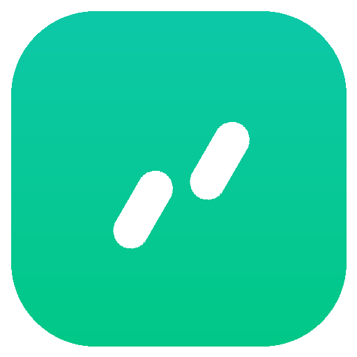

# AutoBuddy

<p align="center">
  <a href="https://github.com/deltrivx/AutoBuddy">
    
  </a>
</p>

<p align="center">
  <strong>面向 NAS 与服务器的 WorkBuddy / CodeBuddy 多账号管理面板与 OpenAI 兼容网关</strong>
</p>

<p align="center">
  <a href="https://github.com/deltrivx/AutoBuddy/releases"></a>
  
  
  
  
  <a href="LICENSE"></a>
</p>

<p align="center">
  <a href="#-项目定位">项目定位</a> ·
  <a href="#-核心能力">核心能力</a> ·
  <a href="#-部署方式">部署方式</a> ·
  <a href="#-持久化与端口">持久化与端口</a> ·
  <a href="#-接入与调用">接入与调用</a> ·
  <a href="CHANGELOG.md">更新日志</a> ·
  <a href="RELEASES.md">版本索引</a>
</p>

---

## 📖 项目定位

`AutoBuddy` 将 WorkBuddy / CodeBuddy 账号管理核心服务容器化，提供开箱即用的 Web 管理面板与 OpenAI 兼容 API 网关。

- **多账号集中管理**：自动签到保活、积分到期监控、Token 自动刷新与用量统计；
- **并发智能分摊**：多账号并发请求自动路由轮询，支持账号级停用、首选指定与单次覆盖；
- **模型级细粒度控制**：支持针对特定账号禁用指定模型，配合后台可用性巡检与自动降级；
- **标准 API 转换**：将全系列大模型转换为标准 OpenAI `/v1` 接口，无缝接入各类下游客户端；
- **自动化账号接入**：内置 GitHub 注册服务与浏览器运行时，全流程可视化。

---

## ⚡ 核心能力

| 能力模块 | 详细说明 |
| :--- | :--- |
| **账号保活与管理** | 支持 OAuth 扫码添加与国际版凭据，自动执行每日签到、积分巡检与 Token 刷新。 |
| **并发轮询账号池** | 请求级无状态分摊，上下文与计费互不串扰；支持按账号停用、设为首选与健康探测。 |
| **模型级禁用控制** | 细粒度控制单个账号的特定模型禁用；支持别名映射阻断与一键恢复。 |
| **可用性自动巡检** | 独立轻量线程定期探活，明确区分凭据失效与模型不可用，支持自动熔断与恢复。 |
| **OpenAI 兼容网关** | 全量大模型自动映射为标准 `/v1/chat/completions` 与 `/v1/models`，支持流式输出。 |
| **API 访问密钥管理** | 支持可选的 Bearer 密钥校验机制，提供密钥新建、启停、连通性回环自检与配额统计。 |
| **容器专属控制台** | 彻底移除宿主桌面专属依赖与无用接口；响应全面禁用缓存，避免配置与状态脱节。 |

---

## 🚀 部署方式

> 容器镜像全部通过 GitHub Actions **云端自动化构建**并推送至 GitHub Packages (GHCR)，严禁本地私有构建。

### 方式一：Unraid 容器模板（强烈推荐）

在 Unraid 环境中，请优先使用官方容器模板更新与维护：

1. 获取模板文件 [unraid/autobuddy.xml](./unraid/autobuddy.xml)；
2. 进入 Unraid 控制台 **Docker** → **Add Container**，选择此模板；
3. 确认端口及 AppData 挂载路径后点击应用启动。

后续更新镜像直接通过 Unraid WebGUI 模板的 **Update / Force Update** 即可完成平滑升级。

### 方式二：Docker Compose

创建 `docker-compose.yml` 文件：

```yaml
services:
  autobuddy:
    image: ghcr.io/deltrivx/autobuddy:latest
    container_name: AutoBuddy
    restart: unless-stopped
    ports:
      - "18090:18090"
      - "18091:18091"
    volumes:
      - /mnt/user/appdata/autobuddy/data:/data
    environment:
      TZ: Asia/Shanghai
```

执行启动：

```bash
docker compose pull && docker compose up -d
```

### 方式三：Docker CLI

```bash
docker run -d \
  --name AutoBuddy \
  -p 18090:18090 \
  -p 18091:18091 \
  -v /mnt/user/appdata/autobuddy/data:/data \
  --restart unless-stopped \
  ghcr.io/deltrivx/autobuddy:latest
```

---

## 📂 持久化与端口

### 端口映射

| 容器内端口 | 默认宿主机端口 | 服务协议 | 用途说明 |
| :--- | :--- | :--- | :--- |
| `18090` | `18090` | HTTP | **Web 控制面板**（账号管理、状态监控、密钥配置） |
| `18091` | `18091` | HTTP | **OpenAI API 网关**（输出标准 `/v1` 接口） |

### 持久化目录

| 容器路径 | 宿主机推荐路径 | 说明 |
| :--- | :--- | :--- |
| `/data` | `/mnt/user/appdata/autobuddy/data` | 系统数据库、账号凭证、选号日志与策略配置。容器升级不丢失任何数据。 |
| `/data/.autobuddy/browsers` | 可选独立挂载 | Playwright 浏览器内核持久化目录，避免重建重复下载。 |

---

## 🔌 接入与调用

### 1. 下游客户端配置（如 Sub2API / Cherry Studio / NextChat）

- **Base URL**: `http://<服务器IP>:18091/v1`
- **API Key**: 在控制台【设置】→【API 接入】中创建的密钥（未开启强制校验时可随意填写）

### 2. cURL 快速测试

```bash
curl -X POST http://localhost:18091/v1/chat/completions \
  -H "Content-Type: application/json" \
  -H "Authorization: Bearer sk-ab-your-key" \
  -d '{
    "model": "deepseek-v3",
    "messages": [{"role": "user", "content": "你好"}],
    "stream": false
  }'
```

---

## 📄 版本与许可

- **更新日志**：详见 [CHANGELOG.md](CHANGELOG.md)
- **版本归档**：详见 [RELEASES.md](RELEASES.md)
- **开源协议**：本项目基于 [MIT License](LICENSE) 授权开发
